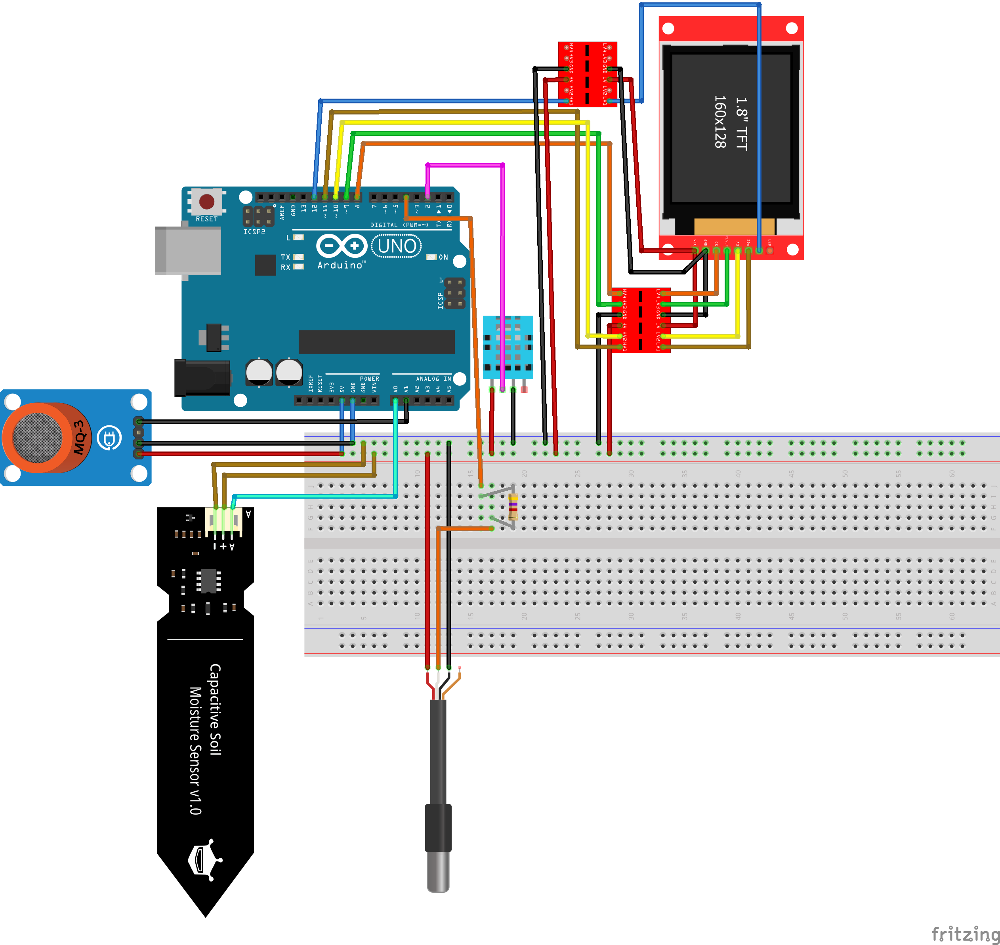

# Projekti dokumentatsioon

## 1. Projekti eesmärk ja seadme lühikirjeldus
**Mis asi see on, mida ja miks me teeme? Millist praktilist probleemi see lahendab?**

Meie projekti eesmärk on luua nutikas taimede hooldussüsteem, mis jälgib keskkonnatingimusi ja kuvab need reaalajas. 
See lahendab probleemi, kus taimekasvatajad peavad pidevalt käsitsi kontrollima mulla niiskust, õhutemperatuuri, niiskust ja õhukvaliteeti.

Seade on eriti kasulik:
Sise- ja välitaimekasvatajatele, kes soovivad automatiseeritud keskkonnaseire süsteemi
Taimekodu harrastajatele, kes tahavad oma taimede kasvuks optimaalseid tingimusi
Eksperimentaalsete taimede kasvatamiseks, kus täpne andmete kogumine on oluline

Peamised komponendid: Arduino Uno R4 Wifi 
                      DHT11 - Sensor mõõdab (õhu) temperatuuri ja õhuniiskust
                      DS18B20 one-wire digital temperature sensor - Sensor mõõdab (mulla) sensori otsaga kontaktis oleva materjali temperatuuri
                      Air Quality sensor MQ135 - Sensor mõõdab õhukvliteeti tajudes osakesi õhus (ning võttes arvesse DHT11 näitusid saab täpsema lugemi)
                      Capacitive Soil Moisture Sensor V1.2 - Mõõdab mulla niiskust
                      ILI9341 2.8 Inch TFT LCD - Ekraan
                      2 x (Level Converter - 3.3V to 5V) - Loogikamuundur Arduino ja ekraani ühendamiseks

---

## 2. Sisendite loetelu
**Millised on süsteemi poolt loetavad / mõõdetavad sisendid? Millega neid mõõdetakse / tuvastatakse?**

- Õhutemperatuur ja niiskus: DHT11 sensor
- Mullatemperatuur (mulla või muu materjali temperatuur): DS18B20 one-wire digitaalne temperatuuri sensor
- Õhukvaliteet (osakeste kontsentratsioon õhus): MQ135 õhukvaliteedi sensor
- Mulla niiskustase: Capacitive Soil Moisture Sensor V1.2

---

## 3. Väljundite loetelu
**Mida süsteem teeb / muudab? Millega väljund realiseeritakse?**

- Keskkonnaparameetrite kuvamine reaalajas: ILI9341 2.8" TFT LCD ekraan
- Andmete edastamine Wi-Fi kaudu (potentsiaalne laiendus): Arduino Uno R4 Wifi sisseehitatud Wi-Fi moodul
- Visuaalne tagasiside kasutajale (näiteks ekraanis kirjeldatud indikaatorid mullaniiskuse / õhku / CO2 kohta)

---

## 4. Nõuded loodavale seadmele
**Mis peab toimuma, kui kasutaja teeb mingi toimingu? Kirjelda käitumisloogika.**

Kui süsteem lülitatakse sisse, siis:
Kõik sensorid alustavad mõõtmisi
Ekraan kuvab avakuva kõigi sensorite hetkeväärtustega
Süsteem kuvab eraldi vaateid iga sensori jaoks

Kasutaja oma arvutis / monitooring süsteemis võib:
Jälgida ajalooliste andmete graafik, et kontrollida rahuldavad väärtused

---

## 5. Süsteemi füüsiliste komponentide loetelu
**Millest seade koosneb? Lisa lingid või täpsed nimed, et keegi teine saaks sama asja uuesti osta / teha.**

Mikrokontroller: Arduino Uno R4 Wifi

Sensorid:
DHT11 - õhu temperatuuri ja niiskuse sensor
DS18B20 one-wire digital temperature sensor - mullatemperatuuri sensor
MQ135 - õhukvaliteedi sensor
Capacitive Soil Moisture Sensor V1.2 - mullaniiskuse sensor

Draiverplaadid/moodulid:
ILI9341 2.8" TFT LCD ekraanimoodul (SPI liides)

---

## 6. Ühendusskeem

---

## 7. Süsteemi juhtiv kood (või pseudokood)
**Kirjelda programmi loogikat nii, et seda on võimalik aru saada ka hiljem.**  

Koodi source: (https://github.com/opppur/Sensuur-Robootika-projekti-dokumentatsioon/blob/main/src/sensuur.ino) 
Koodi kirjeldus: Tööprotsess (loop funktsioon)

Süsteem töötab lõputus tsüklis ja teeb järgmist:

1) Andmete lugemine: Küsib kõigilt anduritelt värsked näidud.

2) Arvutisse saatmine: Kui andmete lugemine õnnestus, prindib kood tulemused Serial Monitorile (arvutiekraanile).

3) Ekraanile kuvamine (ILI9341):
Ekraan puhastatakse iga kord mustaks (fillScreen), et vältida tekstide kattumist.

Andmed kirjutatakse ekraanile erinevate värvidega:
Valge: Õhutemperatuur ja niiskus.
Kollane: Mulla niiskus ja temperatuur.
Roheline: Õhu kvaliteet.

